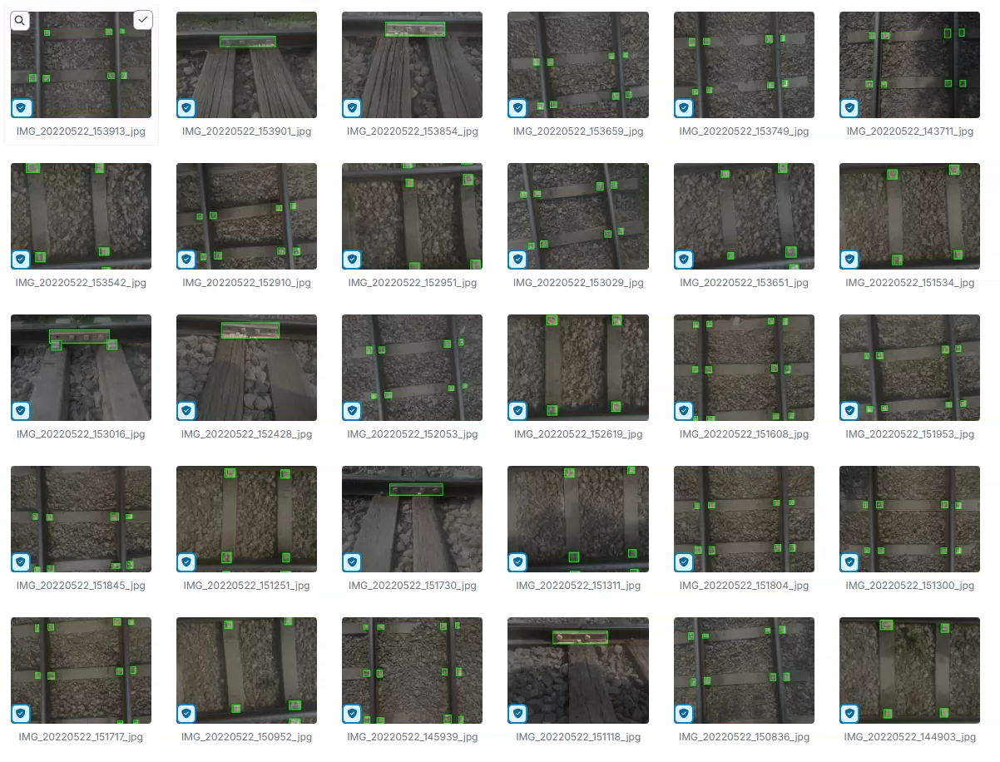
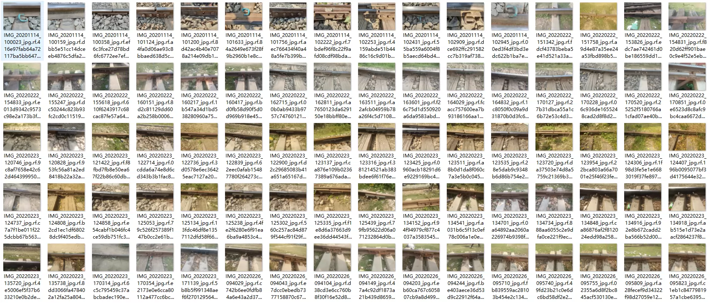
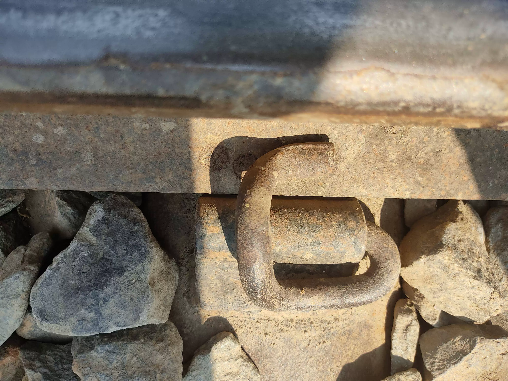
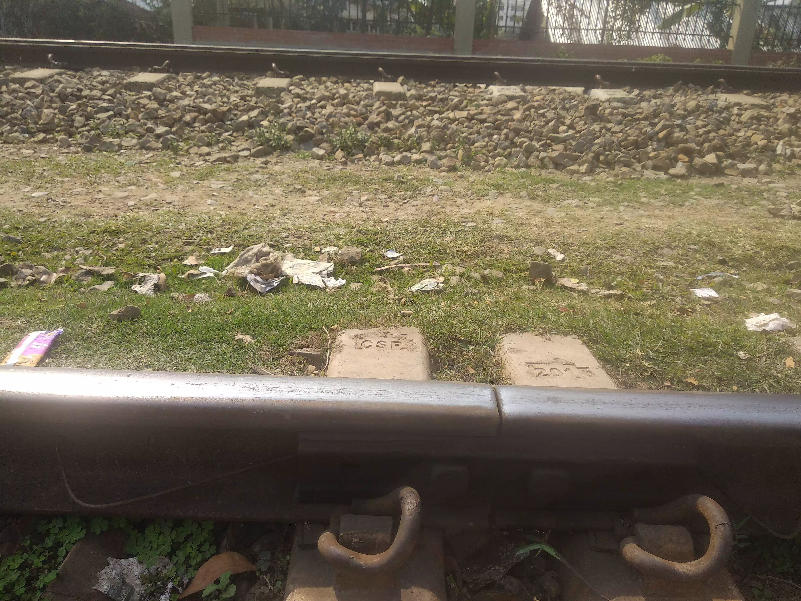
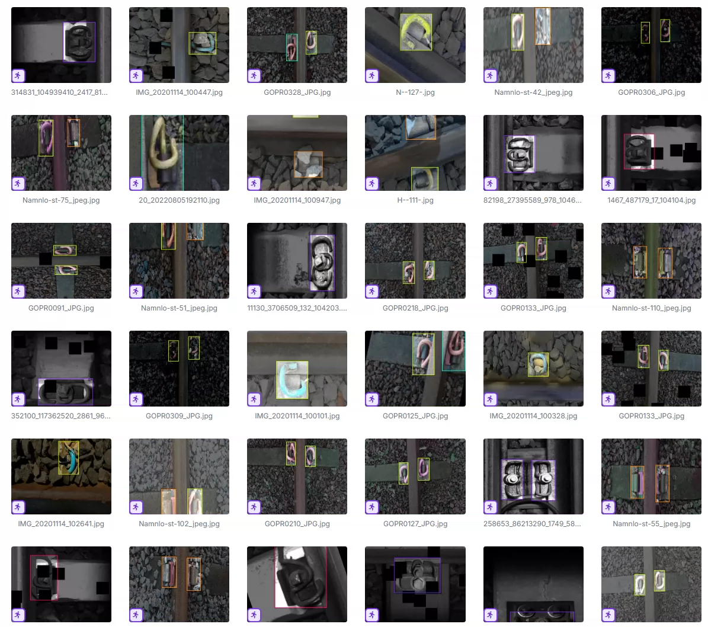
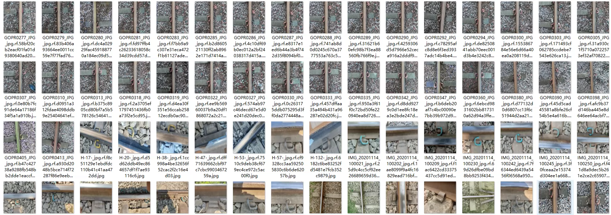
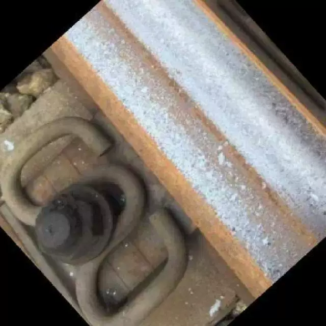
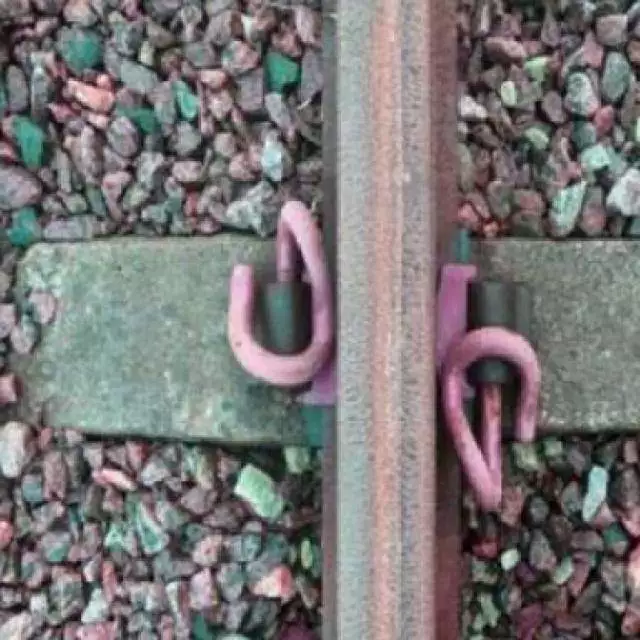

## Body

The railway rail fastener defect detection dataset is in YOLO format with two datasets.

The first dataset, the first four images are shown here:
There are 1876 images in total, each labeled separately.
It is divided into four categories: 'defective fishplate', 'fastener', 'missing fastener', 'non defective fishplate'.
"Defective fishplate", "Fastener", "Missing fastener", "Non-defective fishplate".

The second dataset, the last four images are shown here:
There are 2234 images in total, each labeled separately.
It is divided into six categories: 'fastener', 'fastener-2', 'fastener2_broken', 'fastener_broken', 'Missing', 'Trackbed stuff'.
"Fastener", "Fastener-2", "Broken fastener 2", "Broken fastener", "Missing", "Trackbed stuff".

Electronic virtual products sold without return or exchange.

## Images

item_1038243039659

Here is a pay link on Stripe ( https://buy.stripe.com/3cs8yP7sY87d0vu9AB ). Please contact me lonlonago@foxmail.com after funding $89, and I will send you a complete data files , thank you!

